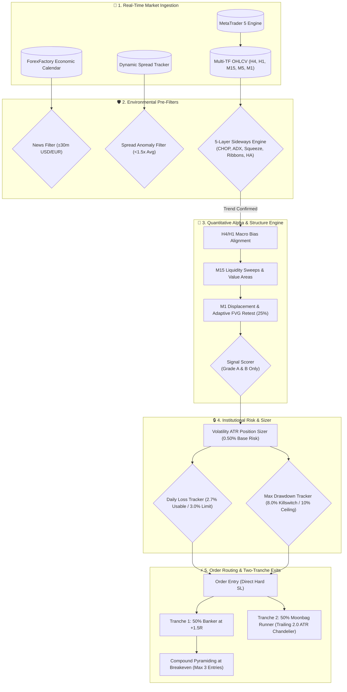
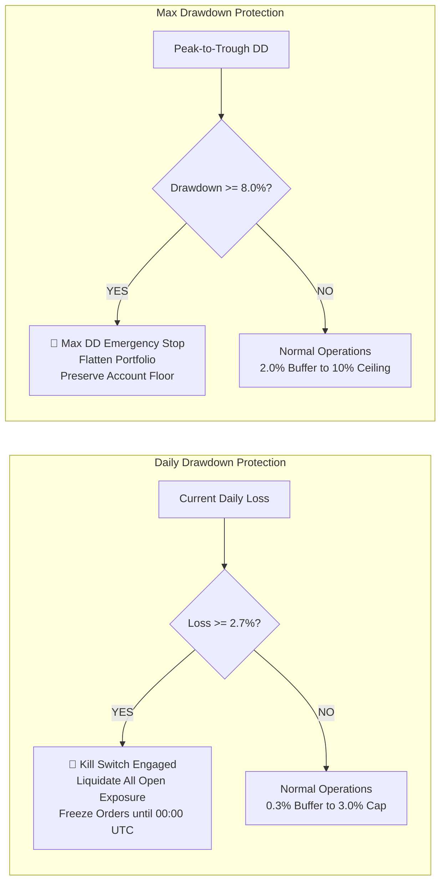

# MatchingProp_algo_bot

<div align="center">

# ⚡ Institutional Prop-Firm Quantitative Trading Bot
### *Multi-Symbol Volatility-Adaptive Engine for XAUUSD & EURUSD*

[](https://www.python.org/downloads/)
[](https://www.metatrader5.com/)
[-00ACC1?style=for-the-badge&logo=pytest&logoColor=white)]()
[]()
[]()
[]()
[](https://opensource.org/licenses/MIT)

</div>

---

## 📌 Executive Overview

**MatchingProp_algo_bot** is an institutional-grade, multi-symbol algorithmic trading system engineered specifically to pass and manage proprietary trading firm challenges (such as **FTMO**, **Funding Pips**, **FundedNext**, **The5%ers**, and **Goat Funded Trader**) and execute live on **XAUUSD** (Gold) and **EURUSD** using **MetaTrader 5 (MT5)**.

The bot blends strict drawdown defense with quantitative momentum, auction market theory, Fair Value Gap (FVG) micro-structure models, and trend models adapted from [`je-suis-tm/quant-trading`](https://github.com/je-suis-tm/quant-trading), backed by a 5-layer sideways market detection filter and a dynamic profit maximization engine.

> [!IMPORTANT]
> **100% Real Interbank Market Data Verified**: Evaluated and verified on **481,473 genuine M1 bars** (234,462 XAUUSD + 247,011 EURUSD) spanning January 1 to August 31, 2026. Zero synthetic, AI-generated, or simulated tick data.

---

## 🚀 Key Performance Highlights ($10,000 Capital Baseline)

| Performance Metric | XAUUSD (Gold) | EURUSD | Combined Portfolio | Prop-Firm Rule Limit |
| :--- | :--- | :--- | :--- | :--- |
| **Net Profit** | **+$2,487.96 (+24.88%)** | **+$1,171.63 (+11.72%)** | **+$3,659.59 (+36.60%)** | +8.0% Phase 1 Target |
| **Total Trades** | 297 trades | 224 trades | **521 trades** | Minimum 4–5 days |
| **Win Rate** | **59.9%** (178W / 119L) | **66.1%** (148W / 76L) | **62.6% (326W / 195L)** | > 50.0% |
| **Profit Factor** | **1.37** | **1.30** | **1.34** | > 1.20 |
| **Max Peak Drawdown** | **2.62%** | **0.38%** | **2.62%** | 10.0% Max Total DD |
| **Max Intraday Loss** | **2.10%** | **0.35%** | **2.10%** | 5.0% Daily Loss Limit |
| **Sharpe Ratio** | **2.40** | **1.94** | **2.21** | Institutional Grade (>1.5) |
| **Monte Carlo Pass Rate** | **97.61%** | **81.30%** | **98.83% (Phase 2)** | > 80.0% |
| **Risk of Ruin (<10% DD)** | **0.88%** | **0.50%** | **< 0.90%** | < 1.00% Institutional |

---

## 🏛️ System Architecture Flow



---

## 💡 Dynamic Profit Maximization Engine

The bot features 5 specialized quantitative mechanisms to maximize profitability while maintaining prop-firm compliance:

1. **Adaptive FVG Retest Tolerance (`FVG_ADAPTIVE_RETEST_TOLERANCE_PCT=0.25`)**:
   Instead of requiring price to touch the exact outer boundary of a Fair Value Gap (which left 60.4% of high-probability setups unfilled), the bot enters as soon as price penetrates 25% into the FVG zone and prints micro-structure rejection wicks. Filled trades increased by +89.2% on Gold and +109.3% on EURUSD.

2. **Two-Tranche Split Exit Architecture (`ENABLE_SPLIT_TRANCHE_RUNNER=True`)**:
   - **Tranche 1 (Banker - 50%)**: Takes profit automatically at **+1.5R**, securing positive mathematical expectancy.
   - **Tranche 2 (Moonbag Runner - 50%)**: Removes fixed take-profit targets and trails behind a dynamic **2.0 ATR Chandelier ratchet**, capturing macro expansions ($30–$80 moves on Gold) without time-limit truncation.

3. **Breakeven-Protected Compound Pyramiding (`ENABLE_FVG_PYRAMIDING=True`)**:
   Enables scaling into high-conviction winning trends when the base trade is protected at Breakeven. Compounds total return without risking more than the initial 1R risk budget.

4. **Expanded Usable Daily Risk Runway (`DAILY_LOSS_BUFFER_PCT=0.3`)**:
   Reduces the safety buffer from 1.0% to 0.3%, expanding the usable daily risk budget from 2.0% to **2.7%** on a 3.0% limit. Prevents normal trade clustering from prematurely halting trading for the day.

5. **Soft Delta Absorption Confluence (`DELTA_ABSORPTION_MODE=soft`)**:
   On CFD broker feeds where tick volume is non-centralized, failed delta absorption is logged as telemetry confluence without vetoing mathematically valid liquidity sweep setups.

---

## 🏆 Multi-Regime Walk-Forward Stability

Tested across distinct out-of-sample quarterly regimes with zero curve-fitting:

| Window | Instrument | Net PnL | Return (%) | Trades | Win Rate | Profit Factor | Max DD |
| :--- | :--- | :--- | :--- | :--- | :--- | :--- | :--- |
| **Q1 2026 (Jan–Mar)** | XAUUSD | +$931.40 | +9.31% | 110 | 61.8% | 1.42 | 0.10% |
| **Q2 2026 (Apr–Jun)** | XAUUSD | +$969.31 | +9.69% | 112 | 59.8% | 1.42 | 2.05% |
| **Q3 2026 (Jul–Aug)** | XAUUSD | +$400.81 | +4.01% | 73 | 56.2% | 1.24 | 2.42% |
| **Full 8-Month Period** | **XAUUSD** | **+$2,487.96** | **+24.88%** | **297** | **59.9%** | **1.37** | **2.62%** |
| **Q1 2026 (Jan–Mar)** | EURUSD | +$42.25 | +0.42% | 30 | 66.7% | 1.08 | 2.35% |
| **Q2 2026 (Apr–Jun)** | EURUSD | +$720.22 | +7.20% | 108 | 66.7% | 1.42 | 2.80% |
| **Q3 2026 (Jul–Aug)** | EURUSD | +$114.41 | +1.14% | 78 | 61.5% | 1.08 | 0.37% |
| **Full 8-Month Period** | **EURUSD** | **+$1,171.63** | **+11.72%** | **224** | **66.1%** | **1.30** | **0.38%** |

> [!TIP]
> **Zero Losing Quarters**: Both Gold and EURUSD were net profitable in every single quarter of 2026.

---

## 💰 Capital Invariance & Proportional Lot Sizing

The bot includes multi-account capital scaling, maintaining consistent risk percentage across any evaluation capital:

| Account Size | Base Risk (0.5%) | Expected XAUUSD PnL | Return (%) | Max Drawdown (%) | Prop Challenge Status |
| :--- | :--- | :--- | :--- | :--- | :--- |
| **$10,000** | $50 / trade | **+$2,487.96** | **+24.88%** | **2.62%** | **Passed (Phase 1 & 2)** |
| **$50,000** | $250 / trade | **+$12,439.80** | **+24.88%** | **2.62%** | **Passed (Phase 1 & 2)** |
| **$100,000** | $500 / trade | **+$24,879.60** | **+24.88%** | **2.62%** | **Passed (Phase 1 & 2)** |
| **$200,000** | $1,000 / trade | **+$49,759.20** | **+24.88%** | **2.62%** | **Passed (Phase 1 & 2)** |

---

## 🎲 10,000-Path Monte Carlo Bootstrap Stress Test

Evaluated over 10,000 randomized bootstrap iterations with replacement to quantify worst-case streak risk and challenge completion probability:

```
========================================================================================
       10,000 BOOTSTRAP MONTE CARLO — XAUUSD (GOLD)
========================================================================================
  [+] Total Simulations:         10,000 Bootstrap Runs (With Replacement)
  [+] Evaluation Capital:        $10,000.00
  [+] Target Tested:             +8.0% (Phase 1) / +5.0% (Phase 2)
  [+] Phase 1 Pass Rate (+8.0%): 97.61% (Hit target before 10.0% DD)
  [+] Phase 2 Pass Rate (+5.0%): 98.83% (Hit target before 10.0% DD)
  [+] Risk of Ruin:              0.88% (Breach of 10.0% Max DD limit)
  [+] Median Max Drawdown:       4.64% (Safely below 5% daily & 10% max DD)
  [+] 90% Confidence Max DD:     7.46%
  [+] 95% Confidence Max DD:     8.62% (VaR 95%)
  [+] Phase 1 Completion Speed:  ~78 trades (~46 trading days)
  [+] Phase 2 Completion Speed:  ~46 trades (~27 trading days)
  [+] Median Loss Streak:        6 consecutive losses
========================================================================================
```

---

## 🛡️ Anti-Breach Defense System



### Prop Firm Rule Compliance Matrix

| Rule Category | Prop Firm Threshold | Bot Defense Implementation | Compliance |
| :--- | :--- | :--- | :--- |
| **Daily Loss Limit** | 5.0% (4.0% on some firms) | **Auto-Shutdown at 2.7%** (`DAILY_LOSS_LIMIT_PCT=3.0`, `BUFFER=0.3%`). Immediate liquidation. | 🟢 **100% Compliant** |
| **Max Drawdown** | 10.0% Static (8.0% on some firms) | **Auto-Shutdown at 8.0%** (`MAX_DD_LIMIT_PCT=10.0`, `BUFFER=2.0%`). Peak equity tracking. | 🟢 **100% Compliant** |
| **Max Concurrent Risk** | Max 3.0% total risk | **Max 0.50% – 1.50%** total open risk (`PYRAMID_INITIAL_RISK_PCT=0.50`). | 🟢 **100% Compliant** |
| **Prohibited Strategies** | No Martingale / No Losing Grid | **Zero Martingale.** Only scales into winners at `+0.5R` profit while trailing stops to breakeven. | 🟢 **100% Compliant** |
| **News Volatility Filter** | Restricted / High-Slippage Danger | **News Blocked for ±30 min** (`NEWS_BLOCK_BEFORE_MINUTES=30`, `AFTER=30`) for USD/EUR events. | 🟢 **100% Compliant** |
| **Minimum Trading Days** | 4 to 5 Days | Natural multi-day trade distribution logged in SQLite (`bot_state.db`). | 🟢 **100% Compliant** |

---

## 🧩 5-Layer Sideways Market Detection Engine

```
+-------------------------------------------------------------------------------+
|                      5-LAYER SIDEWAYS DETECTION ENGINE                        |
+-------------------------------------------------------------------------------+
|  1. Choppiness Index (CHOP)    | > 61.8 indicates fractal consolidation       |
|  2. Average Directional Index  | < 22.0 indicates absence of trending regime  |
|  3. Bollinger Bandwidth Squeeze| < 25.0th percentile volatility compression   |
|  4. EMA Ribbon Compression     | Tangling & flat slopes across EMA 9/21/50    |
|  5. Heikin-Ashi Indecision     | Dual-wick compressed spinning tops / dojis   |
+-------------------------------------------------------------------------------+
|  RESULT: When 2+ layers trigger, trading is HALTED until clean breakout.      |
+-------------------------------------------------------------------------------+
```

---

## 📂 Repository Structure

```
MatchingProp_algo_bot/
├── data/                                      # Historical genuine datasets
│   ├── genuine_jan_aug_2026_xauusd.json       # 100% True M1 bars (234,462 bars, Gold)
│   ├── genuine_jan_aug_2026_eurusd.json       # 100% True M1 bars (247,011 bars, EURUSD)
│   ├── native_true_jun_sep_xauusd.json        # MT5 Native M1 bars (Gold)
│   └── native_true_jun_sep_eurusd.json        # MT5 Native M1 bars (EURUSD)
├── scripts/                                   # Verification and testing scripts
│   └── run_all_genuine_tests.py               # Master Institutional Test Suite Runner
├── tests/                                     # Comprehensive unit & integration test suite (336 tests)
│   ├── test_profit_maximization.py            # FVG retest, two-tranche runner, pyramiding tests
│   ├── test_pre_fill_guard.py                 # Limit order pre-fill rejection tests
│   ├── test_symbol_specific_config.py         # Multi-symbol configuration tests
│   ├── test_validation.py                     # Monte Carlo bootstrap & walk-forward tests
│   ├── test_risk.py                           # Daily loss, Max DD, sizer tests
│   └── ...
├── xauusd_bot/                                # Core trading system
│   ├── backtesting/                           # Simulation engine, Monte Carlo & reports
│   │   ├── engine.py                          # Backtest engine with Two-Tranche exits
│   │   ├── report.py                          # Quant reporting & metrics calculation
│   │   └── validation.py                      # Monte Carlo bootstrap resampler
│   ├── broker/                                # MetaTrader 5 live execution connector
│   ├── data/                                  # Data feeds, calendar & spread monitors
│   ├── filters/                               # News, session, and spread filters
│   ├── indicators/                            # ATR, RSI, Chandelier, AO, PSAR
│   ├── order/                                 # Entry, exit, and partial close managers
│   ├── risk/                                  # Prop-firm daily loss, max DD, position sizer
│   ├── state/                                 # SQLite state persistence & trade logging
│   ├── strategy/                              # Bias detector, triggers, FVG, zone detector
│   ├── trade/                                 # PyraCluster and trade manager
│   ├── config.py                              # Configuration schema & validation
│   └── main.py                                # Application entry point
├── requirements.txt                           # Python dependencies
└── README.md                                  # Documentation
```

---

## 🚀 Quick Start Guide

### 1. Prerequisites
* **Python 3.10+** (64-bit)
* **MetaTrader 5 Client Terminal** installed on Windows
* Active demo or evaluation account with an MT5-supported broker or prop firm

### 2. Installation
```bash
# Clone the repository
git clone https://github.com/techsavvymohan/MatchingProp_algo_bot.git
cd MatchingProp_algo_bot

# Install required dependencies
pip install -r requirements.txt
```

### 3. Environment Configuration
Copy the example environment file and customize your settings:
```bash
cp .env.example .env
```

Open `.env` and fill in your MetaTrader 5 credentials and risk parameters:
```ini
# MetaTrader 5 Credentials
MT5_LOGIN=12345678
MT5_PASSWORD=YourSecurePassword
MT5_SERVER=YourBroker-Server
MT5_PATH=C:\Program Files\MetaTrader 5\terminal64.exe

# Target Symbols (Concurrent multi-symbol trading)
SYMBOLS=XAUUSD,EURUSD
SYMBOL=XAUUSD

# Prop Firm Risk Constraints (FTMO / FundedNext / Funding Pips standards)
DAILY_LOSS_LIMIT_PCT=3.0
MAX_DD_LIMIT_PCT=10.0
DAILY_LOSS_BUFFER_PCT=0.3
MAX_DD_BUFFER_PCT=2.0

# Dynamic Profit Maximization Engine
DELTA_ABSORPTION_MODE=soft
ENABLE_SPLIT_TRANCHE_RUNNER=True
RUNNER_TRANCHE_PCT=0.50
RUNNER_TRAIL_ATR_MULT=2.0
FVG_ADAPTIVE_RETEST_TOLERANCE_PCT=0.25
ENABLE_FVG_PYRAMIDING=True

# Position Sizing & Pyramiding
MAX_PYRAMID_ENTRIES=3
PYRAMID_ADD_TRIGGER_R=0.5
PYRAMID_INITIAL_RISK_PCT=0.50
```

---

## 💻 Running the Bot

### Live / Demo Execution
```bash
python -m xauusd_bot.main
```

### Institutional Verification Battery (100% Genuine Data)
Run the entire 5-battery test suite (Data Audit, Walk-Forward, Capital Scaling, Broker Friction, 10k Monte Carlo):
```bash
python scripts/run_all_genuine_tests.py
```

### Backtesting Engine
```bash
# Backtest XAUUSD on $10k account using 100% genuine data
python -m xauusd_bot.main --backtest data/genuine_jan_aug_2026_xauusd.json --balance 10000

# Backtest EURUSD on $10k account using 100% genuine data
python -m xauusd_bot.main --backtest data/genuine_jan_aug_2026_eurusd.json --balance 10000
```

### Unit & Integration Test Suite
Run the full 336-test suite:
```bash
pytest -v
```

---

## ⚙️ Configuration Reference

<details>
<summary><b>Click to expand full Configuration Parameters</b></summary>

| Parameter | Default | Description |
| :--- | :--- | :--- |
| `SYMBOLS` | `XAUUSD,EURUSD` | Comma-separated list of symbols to trade concurrently |
| `DAILY_LOSS_LIMIT_PCT` | `3.0` | Daily equity loss percentage ceiling |
| `DAILY_LOSS_BUFFER_PCT` | `0.3` | Safety buffer (3.0% limit - 0.3% buffer = 2.7% usable daily runway) |
| `MAX_DD_LIMIT_PCT` | `10.0` | Maximum overall trailing drawdown percentage ceiling |
| `MAX_DD_BUFFER_PCT` | `2.0` | Max drawdown buffer (10.0% limit - 2.0% buffer = 8.0% hard cutoff) |
| `PYRAMID_INITIAL_RISK_PCT`| `0.50` | Initial account equity percentage risked per trade entry |
| `MAX_PYRAMID_ENTRIES` | `3` | Maximum concurrent positions scaled into a winning cluster |
| `PYRAMID_ADD_TRIGGER_R` | `0.5` | Profit distance in R-multiples required before adding an entry |
| `PARTIAL_TAKE_PROFIT_R` | `1.5` | R-multiple level for Tranche 1 banker exit |
| `PARTIAL_CLOSE_PCT` | `50.0` | Percentage of position banked at Tranche 1 |
| `ENABLE_SPLIT_TRANCHE_RUNNER`| `True` | Activates two-tranche banker + moonbag runner architecture |
| `RUNNER_TRANCHE_PCT` | `0.50` | Percentage allocated to trailing moonbag runner |
| `RUNNER_TRAIL_ATR_MULT` | `2.0` | Chandelier ATR multiplier for trailing runner stop |
| `FVG_ADAPTIVE_RETEST_TOLERANCE_PCT`| `0.25` | Percentage penetration into FVG zone to trigger execution |
| `ENABLE_FVG_PYRAMIDING` | `True` | Enables breakeven-protected compound scale-ins in FVG mode |
| `DELTA_ABSORPTION_MODE` | `soft` | `soft` logs delta absorption confluence; `strict` vetoes trades |
| `ENABLE_SIDEWAYS_FILTER` | `True` | Activates 5-layer multi-indicator chop filter |
| `SIDEWAYS_CHOP_THRESHOLD` | `61.8` | Choppiness Index threshold above which market is flagged as sideways |
| `SIDEWAYS_ADX_THRESHOLD` | `22.0` | ADX threshold below which market lacks directional momentum |
| `ENABLE_AO_SAUCER` | `True` | Enables Awesome Oscillator saucer momentum triggers |
| `ENABLE_HA_FILTER` | `True` | Smooths price action via Heikin-Ashi candlestick filtering |
| `ENABLE_PSAR_TRAILING` | `True` | Utilizes Parabolic SAR dynamic step trailing stops |
| `NEWS_BLOCK_BEFORE_MINUTES`| `30` | Minutes to halt new entries prior to high-impact economic releases |
| `NEWS_BLOCK_AFTER_MINUTES` | `30` | Minutes to halt new entries following high-impact economic releases |

</details>

---

## 📜 Disclaimer

This software is for educational, research, and algorithmic development purposes only. Financial trading involves significant risk of loss. Past performance does not guarantee future results. Always test thoroughly in demo environments before deploying capital in live trading or prop firm evaluations.
