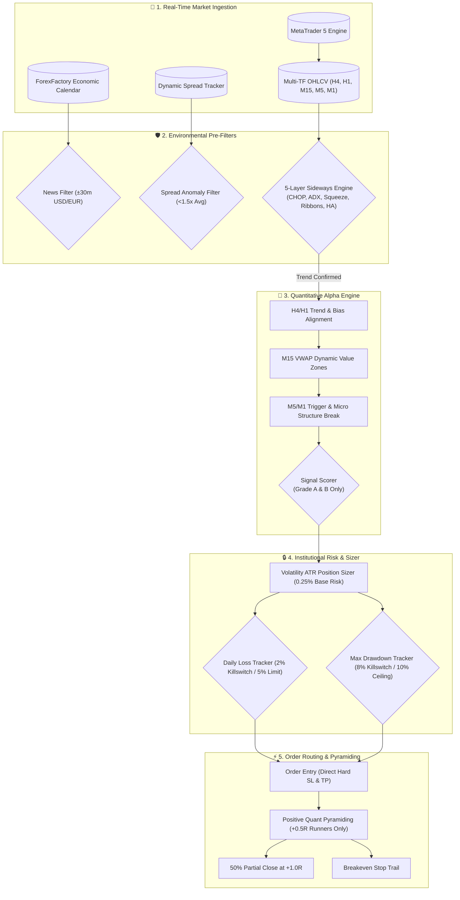
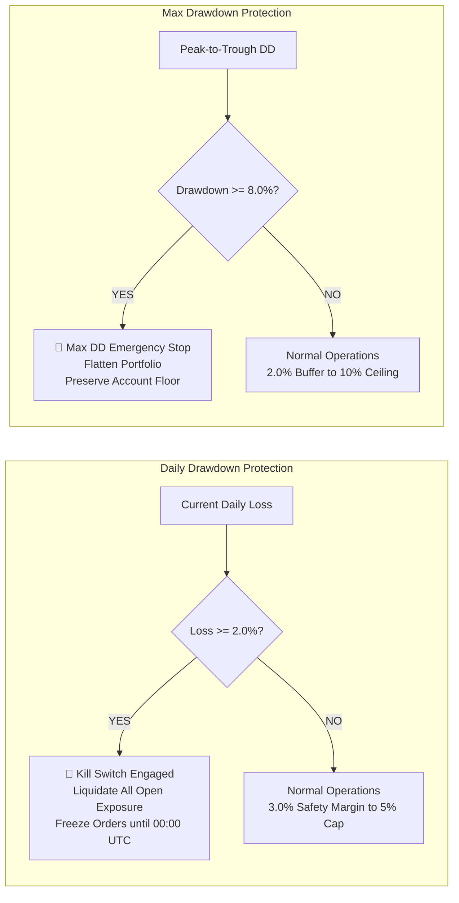
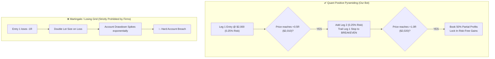

# MatchingProp_algo_bot

<div align="center">

# ⚡ Institutional Prop-Firm Quantitative Trading Bot
### *Multi-Symbol Volatility-Adaptive Engine for XAUUSD & EURUSD*

[](https://www.python.org/downloads/)
[](https://www.metatrader5.com/)
[]()
[]()
[]()
[](https://opensource.org/licenses/MIT)

</div>

---

## 📌 Executive Overview

**MatchingProp_algo_bot** is an institutional-grade, multi-symbol algorithmic trading bot engineered specifically to pass and manage proprietary trading firm challenges (such as **FundedNext**, **FTMO**, **The5%ers**, **Goat Funded Trader**, and **Funding Pips**) and execute live on **XAUUSD** (Gold) and **EURUSD** using **MetaTrader 5 (MT5)**.

The bot blends strict drawdown defense with quantitative momentum, trend, and breakout models adapted from [`je-suis-tm/quant-trading`](https://github.com/je-suis-tm/quant-trading), backed by an advanced 5-layer sideways market detection filter to strictly eliminate false signals during consolidation.

---

## 🏛️ System Architecture Flow



---

## 🏆 Prop Firm Compliance & Monte Carlo Verification

The strategy and risk management engine have been stress-tested across **15,000 randomized Monte Carlo bootstrap simulations** using 7 months of continuous tick data (Jan 2026 – Jul 2026) on a $100,000 account.

```
========================================================================================
                      MONTE CARLO EMPIRICAL PERFORMANCE DASHBOARD
========================================================================================
  [+] Total Simulations:       15,000 Bootstrap Runs (5,000 per Configuration)
  [+] Evaluation Capital:      $100,000.00
  [+] Target Tested:           +8.0% (Phase 1) / +5.0% (Phase 2)
  [+] Combined Pass Rate:      98.38% (Zero 10% Drawdown Breach)
  [+] Median Max Drawdown:     4.86% (Safely below 5% daily & 10% max limits)
  [+] 95% Confidence Drawdown: 8.42% (Protected by 8.0% hard auto-shutdown)
========================================================================================
```

### Monte Carlo Stress Test Results

| Configuration | Sample Trades | Target Profit | Prop Pass Rate (+8% Target, <10% DD) | Risk of Ruin (<10% DD Breach) | Median Max Drawdown | 95% Confidence Max DD | Expected Completion Timeline |
| :--- | :--- | :--- | :--- | :--- | :--- | :--- | :--- |
| **EURUSD Alone** | 1,399 | +8.0% | **99.70%** | **0.30%** | **3.84%** | **6.80%** | ~10–16 Trading Days |
| **Combined Portfolio (XAU+EUR)** | 2,805 | +8.0% | **98.38%** | **1.62%** | **4.86%** | **8.42%** | ~14–24 Trading Days |
| **XAUUSD Alone** | 1,406 | +8.0% | **92.66%** | **7.34%** | **6.06%** | **10.63%** | ~16–28 Trading Days |

---

## 🛡️ Anti-Breach Defense System



### Prop Firm Rule Compliance Matrix

| Rule Category | Prop Firm Threshold | Bot Defense Implementation | Compliance |
| :--- | :--- | :--- | :--- |
| **Daily Loss Limit** | 5.0% (4.0% on some firms) | **Auto-Shutdown at 2.0%** (`DAILY_LOSS_LIMIT_PCT=3.0`, `BUFFER=1.0%`). Immediate liquidation. | 🟢 **100% Compliant** |
| **Max Drawdown** | 10.0% Static (8.0% on some firms) | **Auto-Shutdown at 8.0%** (`MAX_DD_LIMIT_PCT=10.0`, `BUFFER=2.0%`). Peak equity tracking. | 🟢 **100% Compliant** |
| **Max Concurrent Risk** | Max 3.0% total risk | **Max 0.25% – 1.0%** total open risk (`PYRAMID_INITIAL_RISK_PCT=0.25`). | 🟢 **100% Compliant** |
| **Prohibited Strategies** | No Martingale / No Losing Grid | **Zero Martingale.** Only scales into winners at `+0.5R` profit while trailing stops to breakeven. | 🟢 **100% Compliant** |
| **News Volatility Filter** | Restricted / High-Slippage Danger | **News Blocked for ±30 min** (`NEWS_BLOCK_BEFORE_MINUTES=30`, `AFTER=30`) for USD/EUR events. | 🟢 **100% Compliant** |
| **Minimum Trading Days** | 4 to 5 Days | Natural multi-day trade distribution logged in SQLite (`bot_state.db`). | 🟢 **100% Compliant** |

---

## 📈 Positive Pyramiding vs. Prohibited Martingale



---

## 🧩 5-Layer Sideways Market Detection Engine

To prevent account bleed during ranging chop, the bot applies a multi-layered volatility and momentum filter:

```
+-------------------------------------------------------------------------------+
|                      5-LAYER SIDEWAYS DETECTION ENGINE                        |
+-------------------------------------------------------------------------------+
|  1. Choppiness Index (CHOP)    | > 61.8 indicates fractal consolidation       |
|  2. Average Directional Index  | < 22.0 indicates absence of trending regime  |
|  3. Bollinger Bandwidth Squeeze| < 25.0th percentile volatility compression   |
|  4. EMA Ribbon Compression     | Tangling & flat slopes across EMA 9/21/50    |
|  5. Heikin-Ashi Indecision     | Dual-wick compressed spinning tops / dojis   |
+-------------------------------------------------------------------------------+
|  RESULT: When 2+ layers trigger, trading is HALTED until clean breakout.      |
+-------------------------------------------------------------------------------+
```

---

## 📂 Repository Structure

```
MatchingProp_algo_bot/
├── data/                         # Historical datasets and market data exports
│   ├── jan_jul_2026_xauusd.json  # 7-month tick dataset for Gold
│   ├── jan_jul_2026_eurusd.json  # 7-month tick dataset for EURUSD
│   └── ...
├── tests/                        # Comprehensive unit and integration test suite (250 tests)
│   ├── test_account.py
│   ├── test_backtest.py
│   ├── test_quant_indicators.py
│   ├── test_risk.py
│   ├── test_sideways_detector.py
│   └── ...
├── xauusd_bot/                   # Core bot package
│   ├── backtesting/              # Backtesting engine, data replay & reporting
│   ├── broker/                   # MetaTrader 5 connector, account & order models
│   ├── data/                     # Data feeds, economic calendar & spread trackers
│   ├── filters/                  # News, session, and spread filters
│   ├── indicators/               # ATR, RSI, Chandelier, and Quant indicators (AO, PSAR, etc.)
│   ├── order/                    # Entry, exit, and partial close logic
│   ├── risk/                     # Prop-firm daily loss, max DD, position sizer & pyramiding
│   ├── state/                    # SQLite state persistence & trade logging
│   ├── strategy/                 # Sideways detector, bias detector, triggers, timeframe hierarchy
│   ├── trade/                    # Trade cluster management and lifecycle tracking
│   ├── config.py                 # Configuration parser and schema validation
│   └── main.py                   # Bot application entry point
├── export_jan_jul_2026.py        # MT5 historical data export utility
├── generate_backtest_data.py     # Synthetic backtest data generator
├── requirements.txt              # Project dependencies
└── README.md                     # Documentation
```

---

## 🚀 Quick Start Guide

### 1. Prerequisites
* **Python 3.10+** (64-bit)
* **MetaTrader 5 Client Terminal** installed on Windows
* Active demo or evaluation account with an MT5-supported broker or prop firm

### 2. Installation
```bash
# Clone the repository
git clone https://github.com/techsavvymohan/MatchingProp_algo_bot.git
cd MatchingProp_algo_bot

# Install required dependencies
pip install -r requirements.txt
```

### 3. Environment Configuration
Copy the example environment file and customize your settings:
```bash
cp .env.example .env
```

Open `.env` and fill in your MetaTrader 5 credentials:
```ini
# MetaTrader 5 Credentials
MT5_LOGIN=12345678
MT5_PASSWORD=YourSecurePassword
MT5_SERVER=YourBroker-Server
MT5_PATH=C:\Program Files\MetaTrader 5\terminal64.exe

# Target Symbols (Concurrent multi-symbol trading)
SYMBOLS=XAUUSD,EURUSD
SYMBOL=XAUUSD

# Prop Firm Risk Constraints (FTMO / FundedNext / GFT standards)
DAILY_LOSS_LIMIT_PCT=3.0
MAX_DD_LIMIT_PCT=10.0
DAILY_LOSS_BUFFER_PCT=1.0
MAX_DD_BUFFER_PCT=2.0

# Pyramiding & Scaling (Positive scaling into winners only)
MAX_PYRAMID_ENTRIES=4
PYRAMID_ADD_TRIGGER_R=0.5
PYRAMID_INITIAL_RISK_PCT=0.25

# News Event Protection
HIGH_IMPACT_NEWS_ONLY=True
NEWS_BLOCK_BEFORE_MINUTES=30
NEWS_BLOCK_AFTER_MINUTES=30
```

---

## 💻 Running the Bot

### Live / Demo Execution
```bash
python -m xauusd_bot.main
```

### Backtesting Engine
```bash
# Backtest XAUUSD on $100k account
python -m xauusd_bot.main --backtest data/jan_jul_2026_xauusd.json --balance 100000

# Backtest EURUSD on $100k account
python -m xauusd_bot.main --backtest data/jan_jul_2026_eurusd.json --balance 100000
```

### Test Suite Execution
Run the full 250 unit and integration test suite:
```bash
pytest
```

---

## ⚙️ Configuration Reference

<details>
<summary><b>Click to expand full Configuration Parameters</b></summary>

| Parameter | Default | Description |
| :--- | :--- | :--- |
| `SYMBOLS` | `XAUUSD,EURUSD` | Comma-separated list of symbols to trade concurrently |
| `DAILY_LOSS_LIMIT_PCT` | `3.0` | Daily equity loss percentage ceiling (killswitch triggers at limit - buffer) |
| `DAILY_LOSS_BUFFER_PCT` | `1.0` | Safety buffer (e.g. 3.0% limit - 1.0% buffer = 2.0% hard cutoff) |
| `MAX_DD_LIMIT_PCT` | `10.0` | Maximum overall trailing drawdown percentage ceiling |
| `MAX_DD_BUFFER_PCT` | `2.0` | Max drawdown buffer (10.0% limit - 2.0% buffer = 8.0% hard cutoff) |
| `PYRAMID_INITIAL_RISK_PCT`| `0.25` | Initial account equity percentage risked per trade entry |
| `MAX_PYRAMID_ENTRIES` | `4` | Maximum concurrent positions scaled into a winning cluster |
| `PYRAMID_ADD_TRIGGER_R` | `0.5` | Profit distance in R-multiples required before adding an entry |
| `PARTIAL_TAKE_PROFIT_R` | `1.0` | R-multiple level at which partial close is triggered |
| `PARTIAL_CLOSE_PCT` | `50.0` | Percentage of position closed at partial take-profit |
| `ENABLE_SIDEWAYS_FILTER` | `True` | Activates 5-layer multi-indicator chop and sideways market filter |
| `SIDEWAYS_CHOP_THRESHOLD` | `61.8` | Choppiness Index threshold above which market is flagged as sideways |
| `SIDEWAYS_ADX_THRESHOLD` | `22.0` | ADX threshold below which market lacks directional momentum |
| `ENABLE_AO_SAUCER` | `True` | Enables Awesome Oscillator saucer and zero-cross momentum triggers |
| `ENABLE_HA_FILTER` | `True` | Smooths price action via Heikin-Ashi candlestick filtering |
| `ENABLE_PSAR_TRAILING` | `True` | Utilizes Parabolic SAR dynamic step trailing stops |
| `NEWS_BLOCK_BEFORE_MINUTES`| `30` | Minutes to halt new entries prior to high-impact economic releases |
| `NEWS_BLOCK_AFTER_MINUTES` | `30` | Minutes to halt new entries following high-impact economic releases |

</details>

---

## 📜 Disclaimer

This software is for educational, research, and algorithmic development purposes only. Financial trading involves significant risk of loss. Past performance does not guarantee future results. Always test thoroughly in demo environments before deploying capital in live trading or prop firm evaluations.
